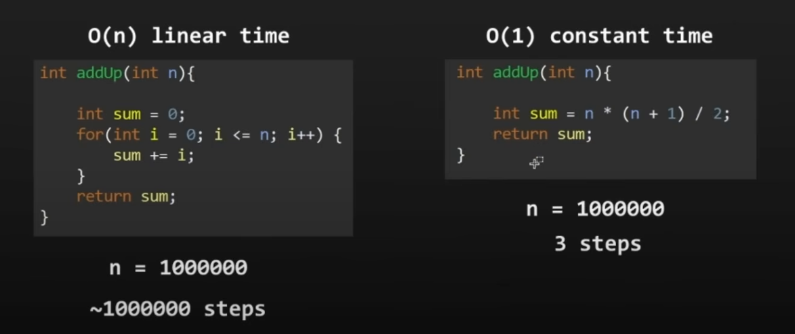

# Big O Notation 🌸

## What does “Big O” mean?

> How code slows as data grows!

Big O notation is a way to describe how fast (or slow) an algorithm grows as the input size gets bigger.

Input size is how much data your algorithm is working on.

**“If I give this algorithm *double the data*, will it take double the time? Ten times the time? A hundred?”**

The table below is ordered from fastest/best to slowest/worst.

| Big O | Name | Means | Examples |
| --- | --- | --- | --- |
| O(1) | Constant time | Takes the same time no matter how big the input is. | - Accessing an element in an array by index.   - Inserting at the beginning of a linked list. |
| O(log n) | Logarithmic | Gets a little slower as data grows, but **very efficient** | Binary Search |
| O(n) | Linear | Time grows **in proportion** to the number of items | - Looping through an array  - Searching through a linked list |
| O(n log n) | Log-linear/Quasilinear | A bit slower than linear, used in many fast sorting algorithms | - Merge sort - Quick sort - Heap sort |
| O(n²) | Quadratic | Time grows **super fast** as data grows (bad if input is big) | - Nested loops (loop inside a loop) - Insertion sort - Selection sort - Bubble sort |
| O(2ⁿ) | Exponential | Becomes **huge** very quickly | Trying all combinations (like brute-force solving puzzles) |
| O(n!) | Factorial Time |  | Travelling salesman problem |

## Example

These two functions do the same thing. They both calculate the sum of all the integers up until n, and return the sum. However, one takes longer to compute than the other.

